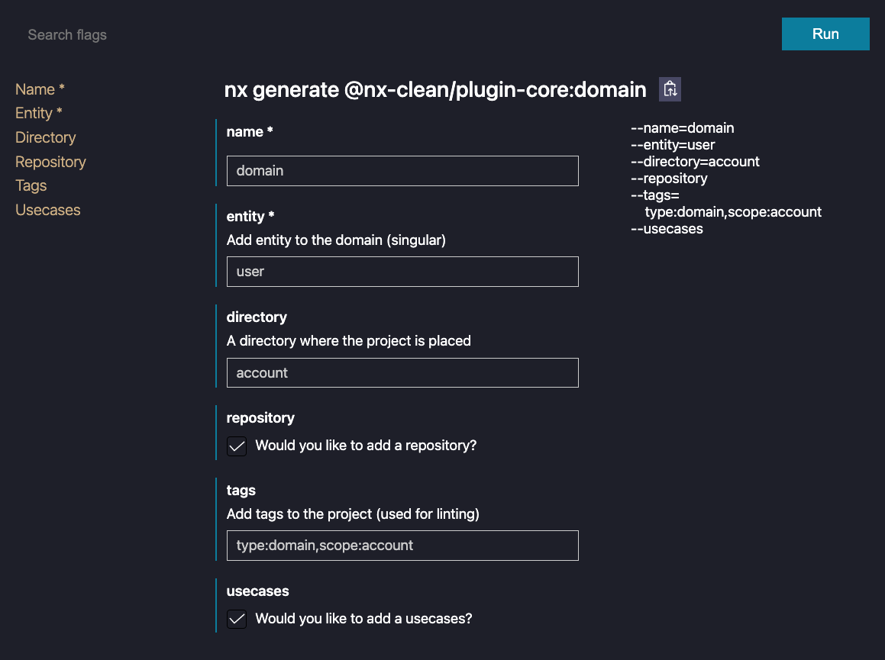

# 🧹 Nx Clean

## Clean Architecture with Nx workspaces

### Install

```sh
npm i @nx-clean/plugin-core
```

### Generators

- [Core](./libs/plugin/core#core---generate)
- [Domain](./libs/plugin/core#domain---generate)
- [Data](./libs/plugin/core#data---generate)

---

### Nx Console with Nx Clean



For developers, Nx extends Nx Console to give you more visibility into your workspace. With Nx Console and Nx in your workflow you can reduce the time it takes to build high-quality software at scale, and improve best-practices across your organization. [Try out Nx Console](https://nx.dev/getting-started/console#nx-console-for-vscode).

Visit [Nx](https://nx.dev/) to learn more.
